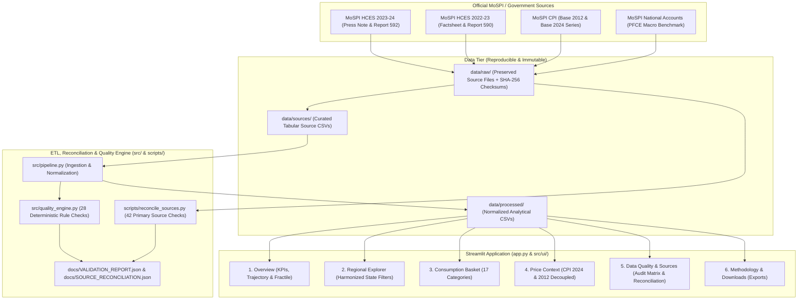

# Project Blueprint: ConsumerLens India
**India Consumer Spending Intelligence & Data Quality Engine**  
**Repository:** `https://github.com/Rishika667/india-consumer-spending-intelligence.git`  
**Current Date:** October 2026  
**Document Status:** AUDITED & IMPLEMENTED SPECIFICATION

---

## 1. Executive Summary & Problem Statement

In the field of syndicated economic research and quantitative market analysis, understanding consumer spending patterns is foundational for market sizing, regional demand forecasting, and consumer product strategy. In India, official household consumer spending data underwent a 12-year hiatus between the 68th round (2011–12) and the modern Household Consumption Expenditure Survey (HCES) series (2022–23 and 2023–24) conducted by the National Sample Survey Office (NSSO), Ministry of Statistics and Programme Implementation (MoSPI).

Crucially, modern official economic releases require deep methodological precision:
1. **HCES 2023–24** provides granular nominal spending distributions across rural and urban geographies, fractile classes, and commodity groups, with a novel dual-valuation method (with vs. without social welfare transfer imputation).
2. **Food Share Distinctions:**
   - **HCES 2022–23 published food shares:** Rural: 46.38%, Urban: 39.17% (without imputation); Rural: 47.47%, Urban: 39.70% (with imputation).
   - **HCES 2023–24 without social-transfer imputation:** Rural: 47.04%, Urban: 39.68%.
   - **HCES 2023–24 with imputation:** Rural: 48.43%, Urban: 40.31%.
   *(Social transfers like PMGKY provide free grains, which, when imputed at market value, slightly increase food budget share in total expenditure).*
3. **MoSPI CPI Series** underwent a historic base-year transition from **Base 2012=100** to **Base 2024=100** in early 2026 (latest release August 2026 with headline inflation 4.82%, CFPI 5.95%), updating weighting diagrams based directly on HCES 2023–24 data and expanding item baskets to 358 items.
4. **National Accounts (PFCE)** measures economy-wide domestic absorption (₹178.6 lakh crore in FY 2023-24, ~60.2% of GDP), which structurally diverges from household survey spending.

**ConsumerLens India** is designed as an interactive, audit-ready research application that demonstrates:
- Methodologically rigorous analysis of secondary official statistics.
- Strict architectural decoupling between household spending and price inflation.
- A deterministic, transparent Data Quality Engine that audits every data point against 25+ integrity checks.
- A recruiter-ready UI tailored for a Syndicated Research Associate or Quantitative Research Analyst.

---

## 2. Target Audience & Personas

| Persona | Role | Primary Objective | Key Value Delivered by ConsumerLens India |
| :--- | :--- | :--- | :--- |
| **Syndicated Research Associate** | Research / Advisory Firm | Author market intelligence reports sizing FMCG, durables, and services across Indian states. | Reliable State/UT MPCE, rural-urban divergence ratios, Engel curves, and one-click data downloads with provenance. |
| **Quantitative Research Manager** | Corporate Strategy / PE | Assess regional consumer purchasing power and evaluate bottom-of-the-pyramid consumption growth. | Dual valuation toggles (unimputed vs. welfare imputed), fractile class deciles, and verifiable official source citations. |
| **Data Quality / Governance Auditor** | Risk & Data Management | Ensure statistical data ingested into enterprise pipelines meets strict validation standards. | Automated audit matrix, deterministic Composite Quality Score (CQS), exception logging, and SHA-256 cryptographic lineage. |

---

## 3. Verified Scope & Data Boundaries

### 3.1 What is IN Scope
1. **MoSPI HCES 2023–24 Official Statements (Report No. 592 / Press Note):**
   - All-India and 18 major States, plus extreme States/UTs, Monthly Per Capita Consumption Expenditure (MPCE).
   - Rural vs. Urban disaggregation.
   - Dual valuation: Out-of-pocket spending (unimputed) and with welfare transfers (imputed).
   - National expenditure shares across detailed commodity groups (food vs. non-food).
   - Fractile class distribution (0–5% to 95–100%) and bottom 5% growth rates (+22.1% rural, +18.7% urban).
2. **MoSPI HCES 2022–23 Comparative Baseline (Report No. 590 / Factsheet):**
   - Year-over-year expenditure shifts under the identical 3-visit CAPI survey framework (all 36 States/UTs).
3. **MoSPI Consumer Price Index (CPI) Context Series:**
   - Historical monthly series (2014–2025, Base 2012=100) across General, Food & Beverages, and core groups.
   - Transition series (Base 2024=100, latest release August 2026: General 108.74, CFPI 110.71) detailing the revised weighting diagram and updated item basket (358 items).
4. **National Accounts (PFCE) Educational Benchmark:**
   - Macroeconomic aggregate context illustrating the structural divergence between PFCE domestic absorption and HCES household spending.
5. **Deterministic Pipeline Validation & Quality Engine:**
   - Exactly 28 automated checks spanning Completeness (25%), Validity (25%), Uniqueness (15%), Internal Consistency (20%), and Provenance (15%).
   - Produces a defensible **Pipeline Validation Score** (100.0%, 28/28 passed) asserting data pipeline hygiene without claiming survey sampling precision.
   - Supported by an independent **Source Reconciliation Engine** (`scripts/reconcile_sources.py`) matching 42 primary benchmarks against preserved raw source texts with 100.0% verification.

### 3.2 What is OUT of Scope (Anti-Goals)
- **NO Stock Market or Commodity Price Prediction:** This is an economic intelligence application, not an algorithmic trading tool.
- **NO Investment Advice or Buy/Sell Signals:** Strictly analytical and descriptive research.
- **NO Runtime LLM Dependency or Autonomous Chatbots:** Avoid hallucinations, latency, and recurring API costs. All commentary is data-driven, deterministic, and verifiable.
- **NO Ad-hoc Spatial Deflation:** State-level MPCE will not be mechanically divided by state CPI indices, as MoSPI explicitly warns against spatial price equivalence assumptions.
- **NO Unauthorized Scraping or Authentication Bypassing:** Unauthenticated microdata downloads requiring NADA credentials will not be simulated or bypassed.
- **NO Fabrication of Unpublished Data:** Official missing observations (e.g. Delhi in 2023-24, non-major state imputations, 2023-24 category shares with imputation) are retained as explicit NaNs.

---

## 4. System Architecture & Ingestion Pipeline

### 4.1 Architectural Topology

---

## 5. Deterministic Data Quality & Validation Engine

### 5.1 Quality Evaluation Dimensions
The engine evaluates 5 distinct dimensions of data hygiene:

1. **Completeness ($w_1 = 0.25$):**
   - Zero missing or `null` values in mandatory composite primary keys (`State_UT`, `Sector`, `Survey_Round`, `Category`).
   - All expected States/UTs present in state-level datasets.
2. **Validity ($w_2 = 0.25$):**
   - Numeric range checks: $\text{MPCE} > 0$, $\text{Growth Rate} \in [-50\%, +150\%]$.
   - Expenditure shares $\in (0\%, 100\%)$.
   - Valid sector values $\in \{\text{'Rural'}, \text{'Urban'}, \text{'Combined'}\}$.
3. **Uniqueness ($w_3 = 0.15$):**
   - Exactly zero duplicate records across primary key tuples `(State_UT, Sector, Round)`.
4. **Internal Consistency ($w_4 = 0.20$):**
   - Sum of commodity group percentage shares equals $100.0\% \pm 0.1\%$ (accounting for rounding).
   - Imputed MPCE $\ge$ Unimputed MPCE for all observations.
   - Urban MPCE $>$ Rural MPCE for all major states.
5. **Provenance & Integrity ($w_5 = 0.15$):**
   - Cryptographic SHA-256 hash match against the raw source extract manifest (`checksums.sha256`).
   - Verification of official MoSPI publication metadata and release dates.

### 5.2 Mathematical Formulation of Composite Quality Score (CQS)

$$\text{CQS} = \sum_{k=1}^{5} w_k \cdot \left( \frac{\sum_{i=1}^{N_k} \mathbb{I}(\text{Check}_{k,i} = \text{PASS})}{N_k} \right) \times 100$$

Where:
- $w_k \in \{0.25, 0.25, 0.15, 0.20, 0.15\}$ and $\sum_{k=1}^{5} w_k = 1.0$.
- $N_k$ is the total count of applicable checks evaluated for dimension $k$.
- $\mathbb{I}(\cdot)$ is the binary indicator function returning 1 if the check passed, 0 otherwise.

---

## 6. Dashboard UI/UX Design & Section Specifications

### Global Controls & Layout Header
- **App Title:** `ConsumerLens India` — *India Consumer Spending Intelligence & Data Quality Engine*
- **Header Badge:** Official MoSPI HCES 2023–24 Release (Dec 27, 2024) | Benchmark: NSS Report 592 & 590
- **Global Valuation Selector:** 
  - `🔘 Out-of-Pocket Expenditure (Without Imputation)` [Default]
  - `🔘 Including Social Welfare Imputation (PMGKY & Free In-Kind Transfers)`

---

### Section 1: Overview (Executive KPI Cards, Macro Trajectory & Distribution)
- **Headline Consumption Indicators:**
  1. **All-India Rural MPCE:** ₹4,122 (Unimputed) / ₹4,247 (Imputed) | $+9.2\%$ nominal YoY vs. 2022–23
  2. **All-India Urban MPCE:** ₹6,996 (Unimputed) / ₹7,078 (Imputed) | $+8.3\%$ nominal YoY vs. 2022–23
  3. **Urban/Rural Consumption Ratio:** $1.70\times$ (₹2,874/mo absolute gap; narrowed from $1.71\times$ in 2022–23 and $1.84\times$ in 2011–12)
  4. **Rural Food Budget Share:** $47.04\%$ (Unimputed) / $48.43\%$ (Imputed) vs. $46.38\%$ in 2022–23
  *(Note: Pipeline Quality Score of 100.0% / 28 checks is positioned as a secondary status indicator in the sidebar and Data Quality section)*
- **Executive Synthesis:** Evidence-based takeaway summarizing national expansion, ratio compression vs. expanding wallet gap, and food share dynamics.
- **Visualizations:**
  - *Chart 1.1: Long-term Consumption Trajectory (2011-12, 2022-23, 2023-24 at Current & Constant 2011-12 Prices).*
  - *Chart 1.2: Fractile Class Spending Distribution (0-5% to 95-100%).* Highlighting bottom 5% baseline and top-tier depth.
- **Analytical Briefings:** 4 syndicated research briefing cards covering macro trends, welfare transfers, food budget shifts, and fractile disparities.

---

### Section 2: Regional Explorer (State/UT Comparisons & Urban-Rural Disparities)
- **Interactive Controls (Implemented):**
  - Cohort quick-selection buttons: **All Geographies**, **Major States**, and **Clear**.
  - Harmonized State/UT Multi-Select synchronizing bar chart, scatter plot, and data table.
  - Survey Round selector: *2023-24* vs. *2022-23*.
  - Sector Breakdown: *Both*, *Rural*, *Urban*.
  *(Roadmap Note: Sub-regional presets such as Northern/Southern and secondary ranking toggles are conceptual extensions).*
- **Visualizations:**
  - *Chart 2.1: Ranked Horizontal Bar Chart of State/UT MPCE.* Clean sorting with generous margin for state names.
  - *Chart 2.2: Spatial Convergence & Disparity Scatter Plot.* Paired Rural vs. Urban MPCE with dynamic national benchmark, 1.00× parity line, and selective anchor labels.
- **State Data Table:** Expandable harmonized table with sector columns and computed Urban-to-Rural ratio.

---

### Section 3: Consumption Basket (Expenditure Categories & Shares)
- **Interactive Controls (Implemented):**
  - Sector Selector: *Rural* vs. *Urban*.
  - Valuation Mode Alignment: Cross-round comparison is evaluated on the official Unimputed series (since 2023–24 item-level imputation was not published by MoSPI in Report 592), with an explicit methodological boundary banner when global imputation is active.
- **Visualizations:**
  - *Chart 3.1: Commodity Group Share Comparison (2022-23 vs. 2023-24).* Grouped horizontal bar chart across 17 commodity categories with generous left margins.
  *(Roadmap Note: A secondary donut visualization was considered during planning but omitted in favor of direct cross-round bar comparison).*
- **Dynamic Research Insights:** Programmatically calculated category shares and YoY percentage-point shifts for the active sector.

---

### Section 4: Price Context (Official MoSPI CPI Trends — Decoupled Economic Context)
- **Mandatory Disclaimers & Alerts:**
  - *Prominent Banner:* **"Strict Methodological Decoupling — MoSPI CPI price indices measure fixed market basket changes across time and must NOT be used as spatial deflators for survey MPCE."**
- **Sub-Tabs:**
  1. *Sub-Tab 4A: Transition Series (Base 2024=100, August 2026 Release):*
     - Headline General CPI: 108.74 (YoY Inflation: 4.82%).
     - Rural CPI: 109.27 (Inflation: 5.23%); Urban CPI: 108.07 (Inflation: 4.31%).
     - Consumer Food Price Index (CFPI): 110.71 (Inflation: 5.95%).
     - Trajectory line chart across 20 months of index and 8 months of YoY inflation.
  2. *Sub-Tab 4B: Historical Baseline (Base 2012=100 Snapshots):*
     - Preserved benchmark reference periods.

---

### Section 5: Data Quality & Sources (Validation Results, Audit Matrix & Lineage)
- **Quality Scorecard:** Deterministic Pipeline Validation Score (100.0%, 28/28 checks passed) across 5 weighted dimensions.
- **Audit Matrix & Availability Register:** Dimension breakdown table and Official Data Availability & Missingness Register detailing 2022–23 and 2023–24 coverage and official unpublished cells.
- **Cryptographic Lineage Manifest:** Automated source reconciliation summary verifying 42/42 matched primary benchmarks against preserved official documents.

---

### Section 6: Methodology & Downloads (Definitions, Limitations & Exports)
- **Methodological Documentation:**
  - CAPI 3-visit panel structure across quarters to eliminate seasonal recall bias.
  - Imputation mechanics for social welfare transfers (PMGKY grains, uniforms, digital devices).
  - Structural Divergence: **HCES vs. National Accounts PFCE** (coverage, NPISH, imputed rent).
- **Export Center (Downloadable Artifacts):**
  - Download Clean Analytical Dataset (`CSV`).
  - Download Data Quality Audit Report (`JSON`).
  - Download Source Register (`CSV`).
  - Download Executive Research Brief (`Markdown`).

---

## 7. Acceptance Criteria & Test Plan

### 7.1 Data Pipeline Acceptance Criteria
- [x] Pipeline runs fully via `python src/pipeline.py` without requiring internet connectivity.
- [x] Imputed MPCE $\ge$ Unimputed MPCE for 100% of rows.
- [x] Food shares reflect verified official facts: 47.04% rural / 39.68% urban without imputation; 48.43% rural / 40.31% urban with imputation.
- [x] Commodity group shares sum to $100.0\% \pm 0.1\%$.
- [x] SHA-256 checksum validation passes for preserved raw files.
- [x] Composite Quality Score $\ge 95.0\%$.

### 7.2 Dashboard Acceptance Criteria
- [x] Application loads in under 3.0 seconds via `streamlit run app.py`.
- [x] All 6 sections are fully interactive and render responsive Plotly charts.
- [x] Interactive filters update charts without runtime errors.
- [x] Zero runtime LLM calls, zero paid API keys, zero external network calls.

---
*End of Audited Project Blueprint.*
